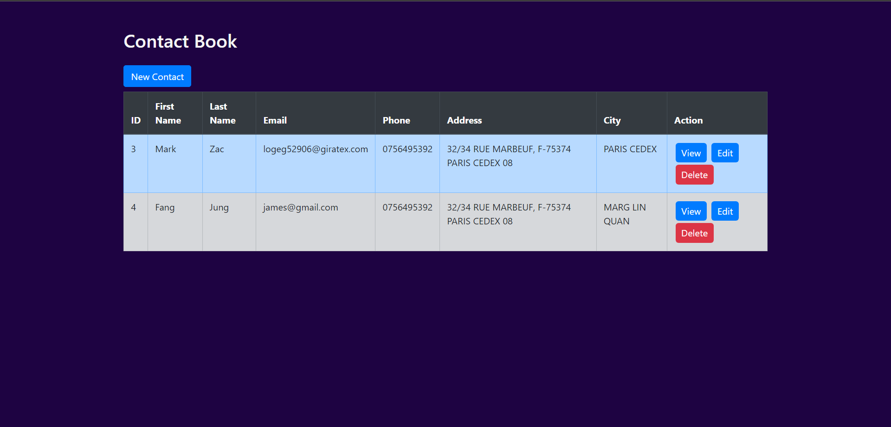
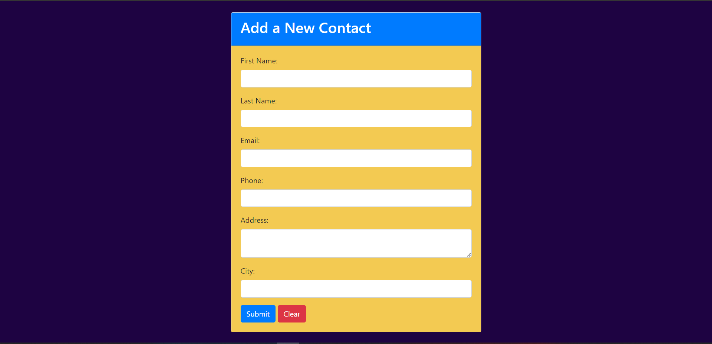
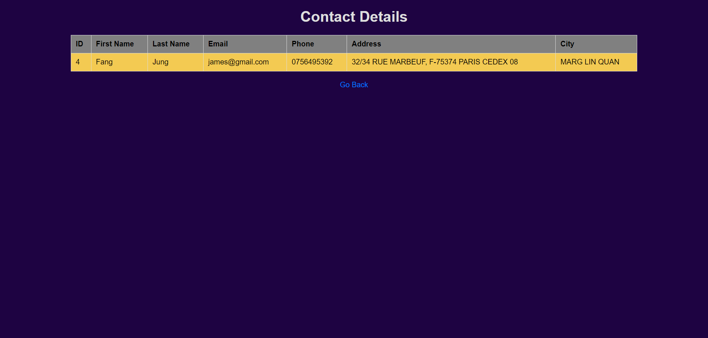
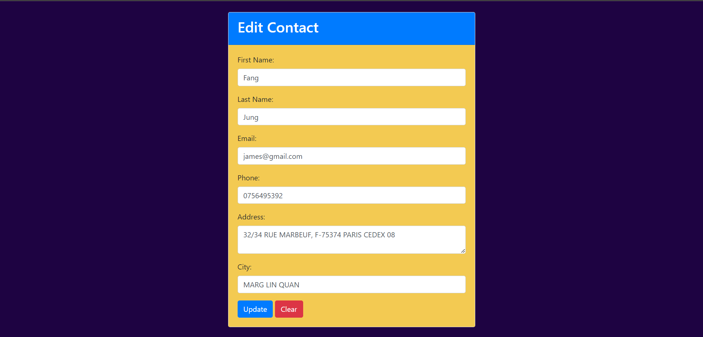

# Contact Management System

The Contact Management System is a web application built using the Laravel framework. It provides functionalities to manage contacts efficiently.

## Features

- **CRUD Operations:** Perform Create, Read, Update, and Delete operations on contacts.
- **User-friendly Interface:** Intuitive interface for managing contacts with ease.
- **Validation:** Input validation to ensure data integrity and security.
- **Bootstrap Integration:** Utilizes Bootstrap for responsive and visually appealing design.

## Usage

1. Open the application.
2. Add, view, edit, or delete contacts from the dashboard.
3. Use the navigation menu to navigate between different sections of the application.

## Contributing

Contributions are welcome! Please fork the repository, make changes, and submit a pull request using different branch.

## License

This project is licensed under the [MIT License](LICENSE).

## Project Preview

**Home Page**

**Add Contact Page**

**View Contact Page**

**Update Contact Page**

